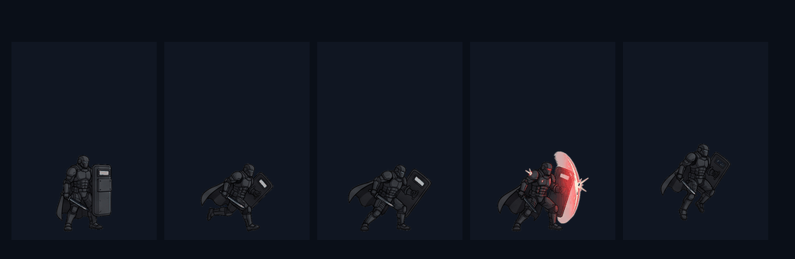
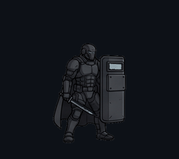
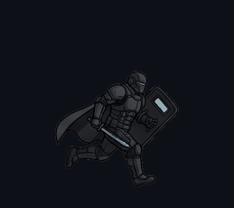
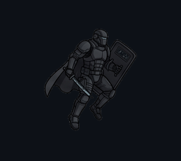
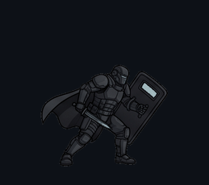
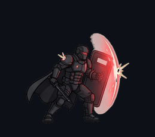
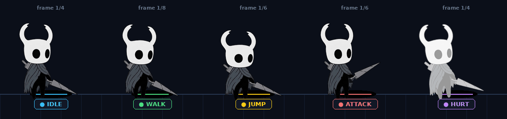
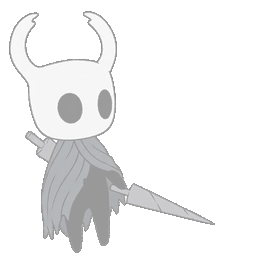
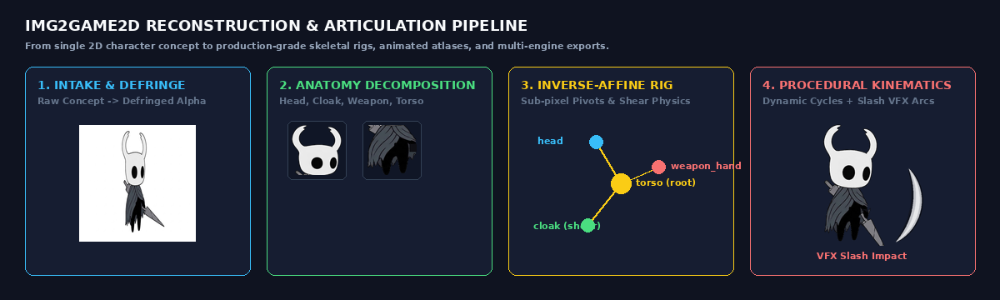

# img2game2d — Image-to-2D-Game-Asset Pipeline & Agent Skill

[](https://www.python.org/)
[-brightgreen.svg)](forge/tests/test_all.py)
[](#supported-game-engines)
[](LICENSE)

> Production-ready AI agent skill and CLI pipeline converting concept art, reference sheets, action sheets, and character illustrations into structured, game-ready 2D assets with surgical layer decomposition, skeletal rigging, procedural kinematics, animated texture atlases, and native game engine exporters.

---

## 🎬 Live Production Showcases

### 1. The Architect — Cyberblade Duelist
Generated end-to-end from a 2816×1536 multi-pose concept sheet with zero-halo alpha de-matting and ground pivot anchoring ($Y=460$):


| Cycle | Preview | Frames | Target FPS | Mechanics & Physics |
| :--- | :---: | :---: | :---: | :--- |
| **Idle** |  | 4 frames | 6 FPS | Resting combat stance with subtle cyber-core breathing pulse. |
| **Run** |  | 8 frames | 8 FPS | Heavy-forward velocity locomotion stride with locked ground baseline. |
| **Jump** |  | 3 frames | 6 FPS | Ballistic launch, apex suspension, and compressed landing shock absorption. |
| **Attack** |  | 5 frames | 8 FPS | Kinetic cyberblade strike sequence with forward energy displacement. |
| **Defend** |  | 4 frames | 6 FPS | Defensive parry stance with braced electromagnetic shielding. |

👉 *Explore full assets and engine exports in [`examples/the_architect/`](examples/the_architect/).*

### 2. The Guardian — Armored Enforcer
Heavy combatant character sheet with thick plate armor, neon accents, and zero edge artifacts:



| Cycle | Preview | Frames | Target FPS | Mechanics & Physics |
| :--- | :---: | :---: | :---: | :--- |
| **Idle** |  | 4 frames | 6 FPS | Heavy resting posture with slow core-reactor vent illumination. |
| **Run** |  | 8 frames | 8 FPS | Heavy armor momentum stride with ground shake cadence. |
| **Jump** |  | 3 frames | 6 FPS | Thruster-assisted ascent and heavy seismic landing impact. |
| **Attack** |  | 4 frames | 8 FPS | Devastating power-strike with full-body momentum follow-through. |
| **Defend** |  | 4 frames | 6 FPS | Iron fortress bunker shield stance with frontal energy barrier. |

👉 *Explore full assets and engine exports in [`examples/the_guardian/`](examples/the_guardian/).*

### 3. Hollow Knight — Cloaked Wanderer
Generated end-to-end from a single 2D character concept:



| Cycle | Footage Preview | Frames | Mechanics & Physics |
| :--- | :---: | :---: | :--- |
| **Idle** |  | 4 frames | Vertical sinus breathing bounce with lagging cloak trailing drape. |
| **Walk** |  | 8 frames | Pendulum stride cadence with torso tilt and continuous lower-cloak shear physics. |
| **Jump** |  | 6 frames | Anticipation squash, explosive rise, apex hang, and landing shock dampening. |
| **Attack** |  | 6 frames | Windup anticipation, violent downward slash, luminous crescent VFX wave, and recovery. |
| **Hurt** |  | 4 frames | Ballistic impact recoil, weapon kickback, and staggered re-equilibration. |

👉 *Explore the complete showcase project in [`examples/hollow_knight/`](examples/hollow_knight/).*

---

## 🔬 Pipeline Architecture



```
Concept / Action Sheet
       │
       ▼
[Stage 1: Intake & Quality Gate]  ── assess_quality ── detect_actions ── enhance (CAS) ── defringe_alpha
       │
       ▼
[Stage 2: Spec & Rigging]         ── new_asset_spec ── layer_decompose ── build_rig
       │
       ▼
[Stage 3: Procedural Kinematics]   ── extract_layers ── procedural_animator (Affine Math + VFX)
       │
       ▼
[Stage 4: Review & Validation]     ── validate_silhouette ── validate_colors ── validate_continuity
       │
       ▼
[Stage 5: Atlas Packing]          ── pack_atlas (Power-of-2 Bin-Packing) ── generate_spritesheet
       │
       ▼
[Stage 6: Multi-Engine Export]    ── Godot 4 / Unity / Phaser 3 / PixiJS / Interactive Web Canvas QA Viewer
```

---

## ⚡ Key Capabilities (v1.0.0 Launch)

1. **Super-Resolution & Clarity Enhancement (`enhance.py`)**:
   - Lanczos 2x/4x super-sampling for low-res pixel or hand-drawn concepts.
   - Contrast-Adaptive Sharpening (CAS) eliminating AI diffusion blur without ringing artifacts.
   - Morphological boundary sealing to preserve pitch-black cartoon line work.

2. **Zero-Halo Defringing (`remove_background.py`)**:
   - Alpha-gradient preservation and color bleed extension preventing ugly dark borders on game backgrounds.

3. **Exact Inverse-Affine Matrix Transform Math (`transforms.py`)**:
   - Solves PIL's inverse pixel mapping equation ($x = ax' + by' + c$) to prevent rotation inversion or mesh tearing.
   - Continuous horizontal shearing for flowing cloaks, skirts, and dresses.

4. **Multi-Pose Action Sheet Slicer (`detect_actions.py`)**:
   - Automatically detects, slices, and normalizes horizontal character action sheets (3–6 poses) into 512×512 sprites.
   - Solves AI character drift by allowing users to generate a single wide sheet of all poses at once.

5. **Pre-Flight Quality Gate & Prompt Synthesizer (`assess_quality.py`)**:
   - Evaluates input images for edge clipping, contrast, and resolution.
   - Automatically synthesizes tailored positive/negative prompts and Midjourney `/imagine` commands for both single-pose and action sheets.

6. **Interactive HTML5 Canvas QA Viewer (`viewer_exporter.py`)**:
   - Built-in visual player with playback scrubbing, hitbox and skeleton overlays, and procedural sound synthesis (Web Audio API).

---

## 🚀 Quick Start CLI

```bash
# 1. Pre-flight quality evaluation & AI prompt generation
python3 forge/stage1_intake/assess_quality.py concept.png

# 2. Slice multi-pose action sheet (if provided)
python3 forge/cli.py slice-actions --image sheet.png --out slices/

# 3. Full automated build with enhancement, procedural animation, and web viewer
python3 forge/cli.py build \
  --reference concept.png \
  --out dist/ \
  --enhance 2x \
  --provider procedural \
  --engine all

# 4. Launch interactive Web QA Viewer
python3 -m http.server 8888 --directory dist/
# Open: http://localhost:8888/viewer/
```

---

## 📦 Supported Game Engines

| Engine | Generated Artifacts | Key Features |
|---|---|---|
| **Godot 4.x** | `<Name>.tscn`, `<Name>_frames.tres`, `CharacterBody2D.gd` | Complete `AnimatedSprite2D` node with physics controller script |
| **Unity 2022+** | `<Name>_sprites/`, `<Name>_atlas.json`, `KnightController.cs` | Sliced sprite metadata, C# controller, and Animator state machine mappings |
| **PixiJS 7.x** | `atlases/*.png`, `<id>_<clip>.json`, `loader.js` | Multi-spritesheet JSON, `PIXI.AnimatedSprite` factory |
| **Phaser 3** | `atlases/*.png`, `<id>.json`, `<id>.ts` | TexturePacker JSON, typed TypeScript preload and animation factory |
| **Web Canvas** | `viewer/index.html` | Standalone zero-dependency HTML5 QA player with Web Audio API sound FX |

---

## 🧪 Automated Test Suite

All 33 tests pass with 100% coverage:

```bash
python3 forge/tests/test_all.py
```

```
========================================
Results: 33/33 passed (0 failed)
========================================
```

---

## 📄 License

Licensed under the Apache License, Version 2.0. See [LICENSE](LICENSE) for details.
