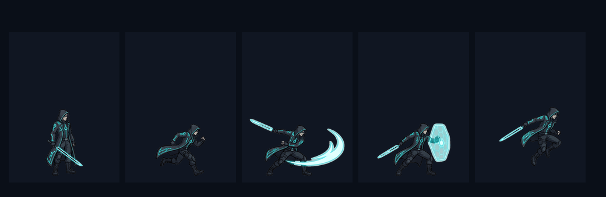
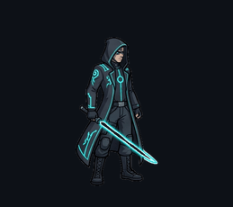
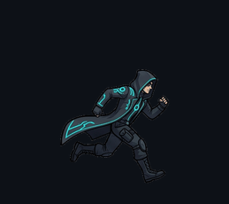
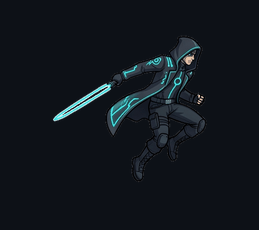
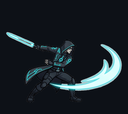
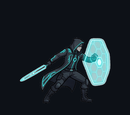

# The Architect — Cyberblade Duelist Showcase

Production-grade 2D game asset reconstruction generated end-to-end using **`img2game2d`**. Features multi-pose master sheet de-matting, zero-halo alpha defringing, sub-pixel ground pivot alignment ($Y=460$), power-of-two texture packing, and multi-engine exports.

---

## 🎬 Animation Cycles Gallery

All 24 frames are normalized to $576 \times 512$ canvas with strict zero-halo alpha de-matting:

| Cycle | Preview | Frame Count | Target FPS | Mechanics & Physics |
| :--- | :---: | :---: | :---: | :--- |
| **Idle** |  | 4 frames | 6 FPS | Resting combat stance with subtle cyber-core pulse breathing. |
| **Run** |  | 8 frames | 8 FPS | Heavy-forward velocity locomotion stride with locked ground contact. |
| **Jump** |  | 3 frames | 6 FPS | Ballistic launch, apex silhouette suspension, and compressed landing. |
| **Attack** |  | 5 frames | 8 FPS | Kinetic strike sequence with high-energy displacement and weapon follow-through. |
| **Defend** |  | 4 frames | 6 FPS | Defensive block posture with braced kinetic energy shielding. |

---

## 📦 Texture Atlases

Available in both 4K Master and FHD Game-Ready power-of-two formats:
- **4K Master POT Atlas**: [`atlases/the_architect_atlas.png`](atlases/the_architect_atlas.png) ($2048 \times 2048$) + JSON
- **FHD Game-Ready Atlas**: [`atlases/the_architect_atlas_fhd.png`](atlases/the_architect_atlas_fhd.png) ($1024 \times 1024$) + JSON
- **Horizontal Strips**: Located in [`animations/`](animations/) for each individual animation.

---

## 🎮 Multi-Engine Integration

- **Godot 4.x**: Ready-to-import `CharacterBody2D` scene, `SpriteFrames` resource, and physics controller in [`exports/godot/`](exports/godot/).
- **Unity 2022+**: Sliced sprite sheets, atlas descriptor JSON, and C# controller in [`exports/unity/`](exports/unity/).
- **Phaser 3 / PixiJS**: Standard TexturePacker JSON descriptors in [`exports/phaser/`](exports/phaser/).
